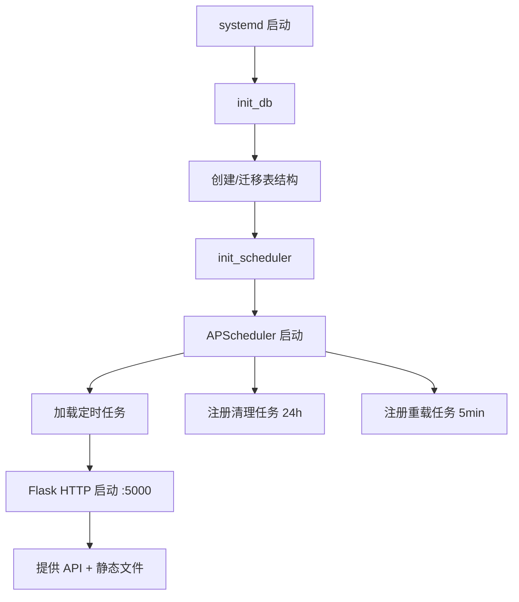

# 运维巡检平台设计方案

## 1. 项目概述

运维巡检平台（Patrol Inspection System）是一款面向 Prometheus 监控体系的自动化巡检工具，旨在替代人工每日检查监控看板的低效模式。系统通过可配置的巡检插件、灵活的调度策略和多渠道通知推送，实现运维巡检的自动化、标准化和可视化。

### 核心目标

- **自动化巡检**：定时执行预定义的巡检项，替代人工重复检查
- **配置灵活**：插件化架构，支持自定义 PromQL 查询和动态阈值
- **实时通知**：巡检结果自动推送至飞书、邮件等多渠道
- **统一视图**：Web UI 集中管理项目、插件、调度和报告

---

## 2. 整体架构

### 2.1 系统分层

```
┌─────────────────────────────────────────────────────┐
│                    Web UI (React SPA)                 │
│         项目管理 | 插件配置 | 通知渠道 | 定时任务        │
│         巡检记录 | 报告查看 | 推送日志 | 系统设置        │
└──────────────────────┬──────────────────────────────┘
                       │ REST API (JSON)
                       ▼
┌─────────────────────────────────────────────────────┐
│              Flask Backend (app.py)                   │
│   ┌─────────────┐  ┌──────────────┐  ┌───────────┐   │
│   │   REST API   │  │  APScheduler │  │  SQLite   │   │
│   │   路由/处理    │  │  定时调度器   │  │  关系型DB  │   │
│   └──────┬──────┘  └──────┬───────┘  └─────┬─────┘   │
│          │                │                 │         │
│          ▼                ▼                 ▼         │
│   ┌─────────────────────────────────────────────┐    │
│   │          InspectionEngine 巡检引擎            │    │
│   │  ┌──────────┐ ┌──────────┐ ┌──────────────┐ │    │
│   │  │ Plugin   │ │ Target   │ │ Instance     │ │    │
│   │  │ Loader   │ │Discovery │ │ Filter       │ │    │
│   │  └────┬─────┘ └────┬─────┘ └──────┬───────┘ │    │
│   │       │            │              │          │    │
│   │       ▼            ▼              ▼          │    │
│   │  ┌──────────┐ ┌──────────┐ ┐ ┌──────────────┐ │    │
│   │  │ Pluins   │ │DataSrc │ │ ReportEngine │ │    │
│   │  │ *.py     │ │ ABC    │ │ (Jinja2)     │ │    │
│   │  └──────────┘ └────────┘ └──────────────┘ │    │
│   └─────────────────────────────────────────────┘    │
└──────────────────┬───────────────────────────────────┘
                   │
                   ▼
┌─────────────────────────────────────────────────────┐
│           Prometheus 监控系统 (数据源)                 │
│   /api/v1/query  /api/v1/targets  /api/v1/alerts     │
└─────────────────────────────────────────────────────┘
```

### 2.2 技术栈

| 层级 | 技术 | 说明 |
|------|------|------|
| 后端框架 | Flask (Python 3.6+) | 轻量级 Web 框架 |
| 数据库 | SQLite (WAL 模式) | 嵌入式关系型数据库 |
| 定时调度 | APScheduler 3.x | cron 表达式调度 |
| 报告模板 | Jinja2 | HTML/Markdown/Text 模板引擎 |
| 前端框架 | React 18 + Vite 5 | SPA 单页应用 |
| 样式 | Tailwind CSS 3 | 原子化 CSS |
| 图标 | Lucide React | 开源图标库 |
| 部署 | Systemd | 服务管理 + 自动重启 |

### 2.3 数据库设计

系统包含 9 张核心表：

| 表名 | 用途 | 核心字段 |
|------|------|----------|
| `projects` | 项目配置 | name, env, prometheus_url, auth 配置 |
| `plugin_configs` | 插件配置（每项目） | plugin_name, job_pattern, thresholds, extra_config_json, extra_config_json, datasource_id |
| `notification_channels` | 通知渠道 | channel_type（feishu/email）, config_json, report_format, enabled |
| `schedules` | 定时任务 | cron_expression, enabled, description |
| `datasource_configs` | 数据源配置（每项目） | ds_type, url, auth 配置 |
| `inspection_records` | 巡检记录 | trigger_type, status, summary_json, report_html/markdown, total_items, abnormal_items |
| `inspection_details` | 巡检明细（每条指标） | plugin_name, target_instance, metric_name, current_value, threshold_value, status, detail |
| `notification_logs` | 推送日志 | record_id, channel_id, channel_type, status, error |
| `app_settings` | 系统设置 | key-value 存储（保留天数等） |

---

## 3. 核心功能模块

### 3.1 项目管理

每个项目对应一个 Prometheus 监控目标，是配置的顶层容器。

**功能要点：**
- 项目 CRUD（项目名、环境标签、Prometheus URL、认证配置）
- Prometheus 连接测试（点击测试按钮验证连通性）
- 环境标签（production / staging / testing）用于区分不同环境

**数据流：** 项目创建 → 配置插件 → 配置通知渠道 → 配置定时任务 → 执行巡检

### 3.2 插件系统

插件是巡检的最小执行单元，每个插件封装一组相关的 PromQL 查询和阈值逻辑。

**架构设计：**

```
BasePlugin (抽象基类)
  ├── NodeExporterPlugin      — 主机 CPU/内存/磁盘/负载
  ├── ProcessExporterPlugin   — 进程线程数
  ├── MySQLExporterPlugin     —  Plugin   — 数据库连接/慢查询/主从延迟
  ├── RedisExporter Plugin    — 内存/客户端/命中率
  ├── CadvisorPlugin          — 容器 CPU/内存
  ├── ElasticsearchPlugin     — 集群健康/节点/JVM 堆
  ├── EtcdPlugin              — Leader 状态/提案积压
  ├── PulsarPlugin            — 消息积压/发布速率
  ├── MinioPlugin             — 对象计数/磁盘离线
  ├── ApisixPlugin            — 5xx 错误率/延迟/QPS
  └── GenericPlugin           — 用户自定义 PromQL 查询
```

**关键机制：**
- **插件发现**：`PluginLoader` 扫描 `plugins/` 目录，动态导入所有继承 `BasePlugin` 的类
- **结果标准化**：每个插件返回统一的 dict 格式 `{metric_name, current_value, threshold_value, status, detail}`
- **阈值检测**：`BasePlugin._check_threshold()` 支持按指标名查阈值，返回 "正常" / "警告" / "严重"
- **自定义查询**：`GenericPlugin` 支持在 UI 上动态添加 PromQL 查询、阈值和严重级别

**配置项（每插件）：**
- `job_pattern`：正则表达式，匹配 Prometheus 中的 job 名称
- `thresholds`：指标阈值字典（`{metric_name: {warning, critical}}`）
- `extra_config`：扩展配置（Generic插件用此存储自定义查询列表）
- `datasource_id`：关联的数据源（不指定则使用项目默认数据源）
- `filter_config`：实例过滤配置（白名单、黑名单、标签、健康状态）

### 3.3 数据源抽象层

**设计目标：** 解耦插件与 Prometheus，支持未来接入其他监控系统。

**核心接口（`DataSource` ABC）：**

| 方法 | 用途 |
|------|------|
| `query(q)` | 执行即时查询 |
| `discover_targets()` | 发现监控目标 |
| `get_alerts()` | 获取活动告警 |
| `test_connection()` | 测试连接 |

**当前实现：** `PrometheusDataSource` — 封装 `PrometheusClient`，通过 Prometheus HTTP API 查询

**注册机制：** `DataSourceRegistry` — 类型名到实现类的映射，支持动态注册新数据源类型

### 3.4 目标发现与过滤

**TargetDiscovery（`core/discovery.py`）：**
- 调用数据源的 `discover_targets()` 获取所有 job 和目标实例
- `match_jobs_by_pattern()` — 正则匹配 job 名称，将插件与 job 绑定
- `suggestion_mapping()` — 根据 job 名称建议插件映射（如 `node_exporter` → node）

**InstanceFilter（`core/filter.py`）：**
- **白名单过滤**：正则匹配，只保留匹配的实例
- **黑名单过滤**：正则匹配，排除匹配的实例
- **健康状态过滤**：只保留 `up` 或 `down` 的实例
- **标签过滤**：按 key=value 标签精确匹配

### 3.5 巡检执行引擎

`InspectionEngine.run()` 是核心调度方法，执行一次完整巡检：

```
1. 获取项目信息和启用的插件配置
2. 创建巡检记录 (status = 'running')
3. 初始化数据源（默认 + 插件级覆盖）
4. 发现所有监控目标
5. 遍历每个启用的插件：
   ├── 选择对应数据源
   ├── 正则匹配 job
   ├── 应用实例过滤
   ├── 加载插件类并实例化
   ├── 遍历匹配的实例执行 inspect()
   └── 异常时记录错误
6. 获取活动告警
7. 生成多格式报告
8. 计算统计指标
9. 保存结果到数据库
10. 返回 record_id
```

### 3.6 报告引擎

`ReportEngine.generate()` 使用 Jinja2 模板生成四种格式的报告：

| 格式 | 模板文件 | 用途 |
|------|----------|------|
| HTML | `report.html.j2` | Web 端预览 |
| Markdown | `report.md.j2` | 飞书/钉钉推送 |
| Text | `report.txt.j2` | 邮件正文 |
| JSON | 程序内生成 | API 调用/数据导出 |

**报告内容包含：**
- 项目名称、巡检时间、健康评分
- 各插件/目标的检查结果汇总
- 异常项详情（指标、实际值、阈值、状态）
- 当前告警列表

### 3.7 通知推送

**渠道支持：**
- **飞书机器人**：交互式卡片（Feishu Card）— 包含状态颜色、指标汇总、完整报告链接
- **邮件**：SMTP SSL/TLS，HTML 格式报告

**推送场景：**
- 手动推送：巡检记录列表点击"推送"按钮
- 渠道测试：配置时点击"测试发送"
- 自动推送：定时巡检完成后自动推送至所有启用的渠道

**推送日志（`notification_logs`）：**
- 记录每次推送的目标、状态、错误信息
- 支持手动删除
- 保留策略与系统设置一致

### 3.8 定时任务

基于 APScheduler 的 cron 调度：

- **cron 表达式**：标准的 5 段式（分 时 日 月 周）
- **每项目独立配置**：每个项目可设置不同的定时规则
- **启用/禁用**：支持开关控制，无需删除
- **自动重载**：定时任务变更后立即生效
- **自动推送**：定时巡检完成后自动通知所有启用的渠道

**调度器实现：**
- `BackgroundScheduler`（后台线程）
- `timezone=Asia/Shanghai`
- 每 5 分钟检查任务变更
- 数据清理任务每 24 小时执行一次

### 3.9 数据保留策略

| 配置项 | 默认值 | 说明 |
|--------|--------|------|
| `records_retention_days` | 90 | 巡检记录保留天数 |
| `details_retention_days` | 90 | 巡检明细保留天数（含推送日志） |

清理任务每 24 小时自动执行，保留策略与系统设置一致。

---

## 4. 前端设计

### 4.1 UI 结构

SPA 单页应用 + 标签页导航（无路由库）：

```
PatrolDashboard
├── 顶部导航
│   ├── Logo / 项目名称
│   ├── 全局统计（项目数/记录数）
│   └── 项目选择器
├── 标签页
│   ├── 项目管理     — 项目列表 + 编辑/删除/快速巡检
│   ├── 插件配置     — 插件卡片 + 自动发现 + 阈值编辑 + 指标编辑器
│   ├── 数据源管理   — 多数据源 CRUD + 连接测试
│   ├── 通知渠道     — 渠道卡片 + 配置表单 + 测试/发送
│   ├── 推送日志     — 推送记录表格 + 删除
│   ├── 定时任务     — Cron 任务列表 + 添加/编辑/删除/开关
│   ├── 巡检记录     — 记录表格 + 触发类型筛选 + 报告/推送/删除
│   ├── 报告预览     — 多格式切换（HTML/Markdown/JSON）
│   └── 系统设置     — 保留天数配置
└── 模态框组
    ├── 添加/编辑项目
    ├── 添加插件
    ├── 添加/编辑通知渠道
    ├── 添加数据源
    ├── 指标编辑器（Generic 插件）
    └── 添加/编辑定时任务
```

### 4.2 状态管理

所有状态集中在一个组件中，使用 `useState` 管理：

| 状态 | 类型 | 用途 |
|------|------|------|
| `activeTab` | string | 当前标签页 |
| `selectedProject` | object | 当前选中项目 |
| `projects` | array | 项目列表 |
| `pluginConfigs` | array | 插件配置列表 |
| `channels` | array | 通知渠道列表 |
| `records` | array | 巡检记录列表 |
| `schedules` | array | 定时任务列表 |
| `notificationLogs` | array | 推送日志列表 |
| `datasources` | array | 数据源列表 |
| `reportData` | object | 报告内容 |
| `{html, markdown, summary}` |
| `settings` | object | 系统设置 |
| `showModal` | string | 当前打开的模态框 |

### 4.3 API 交互

- 统一 `apiFetch()` 函数封装 `fetch()`，自动处理 JSON 序列化和错误
- 所有接口路径以 `/api/` 开头
- Vite dev server 配置 `/api` 代理到 `localhost:5000`

---

## 5. 部署架构

### 5.1 部署方式

```
┌─────────────────────────────────────────┐
│           服务器 (Linux)                   │
│                                           │
│  systemd ─── patrol.service               │
│               ├── app.py (Flask :5000)     │
│               ├── patrol.db (SQLite)       │
│               ├── web/dist/ (静态文件)      │
│               └── logs/patrol.log         │
│                                           │
│  Nginx（可选）                              │
│    └── 反向代理 :80 → :5000                │
│                                           │
│  防火墙                                     │
│    └── 开放 5000 端口                       │
└─────────────────────────────────────────┘
```

### 5.2 环境配置

通过 systemd drop-in 文件注入环境变量：

```ini
# /etc/systemd/system/patrol.service.d/env.conf
[Service]
Environment="PATROL_BASE_URL=http://192.168.90.137:5000/"
Environment="PATROL_DB_PATH=/opt/patrol/patrol.db"
```

### 5.3 启动流程



---

## 6. API 接口清单

### 项目管理
| 方法 | 路径 | 说明 |
|------|------|------|
| GET | `/api/projects` | 列表 |
| POST | `/api/projects` | 创建 |
| PUT | `/api/projects/<id>` | 更新 |
| DELETE | `/api/projects/<id>` | 删除 |

### 插件管理
| 方法 | 路径 | 说明 |
|------|------|------|
| GET | `/api/projects/<id>/plugins` | 列表 |
| POST | `/api/projects/<id>/plugins` | 批量保存 |
| GET | `/api/projects/<id>/discover` | 自动发现 |

### 通知渠道
| 方法 | 路径 | 说明 |
|------|------|------|
| GET | `/api/projects/<id>/channels` | 列表 |
| POST | `/api/projects/<id>/channels` | 创建 |
| PUT | `/api/projects/<id>/channels/<id>` | 更新 |
| DELETE | `/api/projects/<id>/channels/<id>` | 删除 |

### 定时任务
| 方法 | 路径 | 说明 |
|------|------|------|
| GET | `/api/projects/<id>/schedules` | 列表 |
| POST | `/api/projects/<id>/schedules` | 创建 |
| PUT | `/api/projects/<id>/schedules/<id>` | 更新 |
| DELETE | `/api/projects/<id>/schedules/<id>` | 删除 |

### 数据源
| 方法 | 路径 | 说明 |
|------|------|------|
| GET | `/api/projects/<id>/datasources` | 列表 |
| POST | `/api/projects/<id>/datasources` | 创建 |
| PUT | `/api/projects/<id>/datasources/<id>` | 更新 |
| DELETE | `/api/projects/<id>/datasources/<id>` | 删除 |
| POST | `/api/projects/<id>/datasources/<id>/test` | 测试连接 |

### 巡检执行
| 方法 | 路径 | 说明 |
|------|------|------|
| POST | `/api/projects/<id>/inspect` | 触发巡检 |
| GET | `/api/projects/<id>/records` | 记录列表（支持 `?trigger_type=` 过滤） |
| GET | `/api/records/<id>` | 获取记录 |
| DELETE | `/api/records/<id>` | 删除记录 |
| GET | `/api/records/<id>/report?format=` | 获取报告 |
| GET | `/api/records/<id>/preview` | 报告预览 |
| GET | `/api/records/<id>/details` | 明细列表 |

### 通知推送
| 方法 | 路径 | 说明 |
|------|------|------|
| POST | `/api/records/<id>/send` | 推送到所有渠道 |
| POST | `/api/records/<id>/send/<ch_id>` | 推送到指定渠道 |
| POST | `/api/test/notification` | 测试推送 |

### 推送日志
| 方法 | 路径 | 说明 |
|------|------|------|
| GET | `/api/projects/<id>/notification-logs` | 列表 |
| DELETE | `/api/notification-logs/<id>` | 删除 |

### 系统
| 方法 | 路径 | 说明 |
|------|------|
| GET/PUT `/api/settings` | 系统设置（保留天数） |
| GET `/api/stats/overview` | 全局统计 |
| POST `/api/test/prometheus` | 测试 Prometheus 连接 |

---

## 7. 巡检执行流程（完整时序）

```
用户/定时器                     Web UI                    Backend API          SQLite            Prometheus
    │                            │                        │                    │                  │
    │  点击"立即巡检"            │                        │                    │                  │
    │ ──────────────────────────► │                       │                    │                  │
    │                            │ POST /inspect          │                    │                  │
    │                            │ ─────────────────────► │                    │                  │
    │                            │                        │ 创建巡检记录        │                  │
    │                            │                        │ ──────────────────► │                  │
    │                            │                        │ 发现目标            │                  │
    │                            │                        │ ──────────────────────────────────► │
    │                            │                        │ ◄────────────────────────────────── │
    │                            │                        │                    │                  │
    │                            │                        │ 遍历插件:          │                  │
    │                            │                        │  1. 加载插件类      │                  │
    │                            │                        │  2. 匹配 Job        │                  │
    │                            │                        │  3. 过滤实例        │                  │
    │                            │                        │  4. inspect()       │                  │
    │                            │                        │ ──────────────────────────────────► │
    │                            │                        │ ◄────────────────────────────────── │
    │                            │                        │                    │                  │
    │                            │                        │ 收集结果           │                  │
    │                            │                        │ 生成报告           │                  │
    │                            │                        │ 保存明细           │                  │
    │                            │                        │ ──────────────────► │                  │
    │                            │ ◄─── {record_id} ──── │                    │                  │
    │  ◄── 显示结果 ────────── │                        │                    │                  │
    │                            │                        │                    │                  │
    │  点击"推送"               │                        │                    │                  │
    │ ──────────────────────────► │                       │                    │                  │
    │                            │ POST /records/id/send  │                    │                  │
    │                            │ ─────────────────────► │                    │                  │
    │                            │                        │ 获取报告 + 渠道      │                  │
    │                            │                        │ ──────────────────► │                  │
    │                            │                        │ ◄────────────────── │                  │
    │                            │                        │ 发送飞书卡片        │                  │
    │                            │                        │ ────────── 飞书 API ────────────────► │
    │                            │                        │ 记录推送日志        │                  │
    │                            │                        │ ──────────────────► │                  │
    │                            │ ◄─── 推送结果 ─────── │                    │                  │
```

---

## 8. 扩展性设计

### 8.1 新增数据源

实现 `DataSource` 抽象类的所有方法，注册到 `DataSourceRegistry`：

```python
from core.datasource import DataSource, get_default_registry

class ZabbixDataSource(DataSource):
    def query(self, q):
        # Zabbix API 查询实现
        pass

get_default_registry().register("zabbix", ZabbixDataSource)
```

### 8.2 新增通知渠道

继承 `BaseNotifier` 实现 `send()` 方法，后端添加渠道类型处理：

```python
from notifiers.base import BaseNotifier

class DingTalkNotifier(BaseNotifier):
    def send(self, title, content, content_type="markdown"):
        # 钉钉机器人 API 实现
        pass
```

### 8.3 新增巡检插件

在 `plugins/` 目录下创建新文件，继承 `BasePlugin` 实现 `inspect()`：

```python
from plugins.base import BasePlugin

class NginxPlugin(BasePlugin):
    def inspect(self, instance):
        # NGINX 指标检查
        pass
```

插件会自动被 `PluginLoader` 发现并注册。

---

## 9. 安全设计

- **无用户认证**：当前为内网工具，未实现 RBAC
- **认证信息加密**：Prometheus Basic Auth、邮件密码存储在 SQLite 中
- **CORS 限制**：Flask dev server 默认绑定 `0.0.0.0`，建议生产用 Nginx 反向代理
- **输入校验**：服务端对前端传入的 JSON 做类型校验
- **SQL 注入防护**：使用参数化查询（`?` 占位符）

---

## 10. 注意事项与改进方向

### 当前局限

- **单用户**：无用户认证和权限管理
- **SQLite 并发**：WAL 模式缓解但仍有写锁竞争
- **前端单体**：~1850 行单组件，可维护性较低
- **仅 Prometheus**：虽已抽象 DataSource，但尚未接入其他监控系统

### 可改进方向

1. **多用户与 LDAP 集成**
2. **MySQL/PostgreSQL 支持**替代 SQLite
3. **前端路由拆分**：React Router 多页面
4. **更多多渠道**：钉钉、企业微信、Slack
5. **自定义报告模板**：用户上传自己的 Jinja2 模板
6. **告警收敛**：基于巡检结果的自动告警聚合
7. **历史趋势**：指标历史数据图表展示
8. **离线部署优化**：已支持离线包构建

---

> 文档版本：v1.0  
> 最后更新：2026-05-18